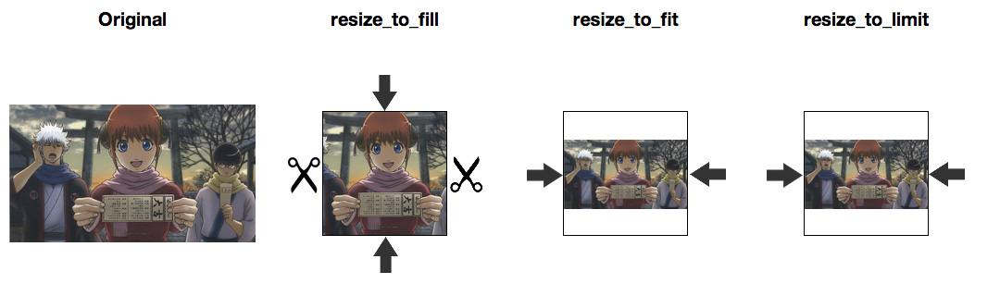
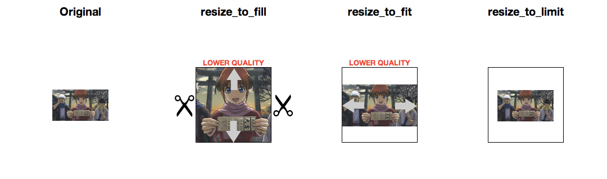
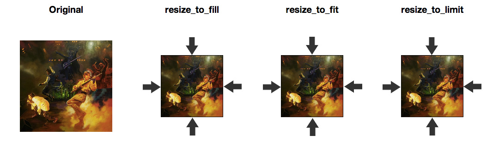
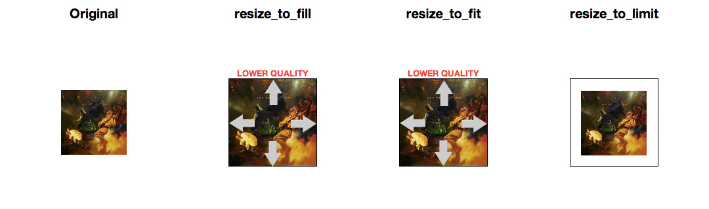
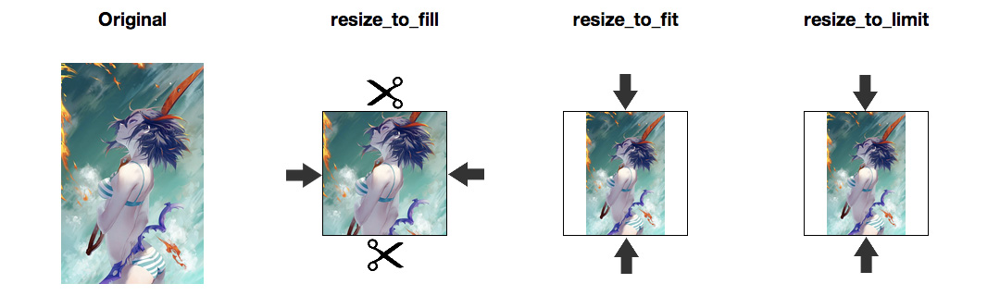
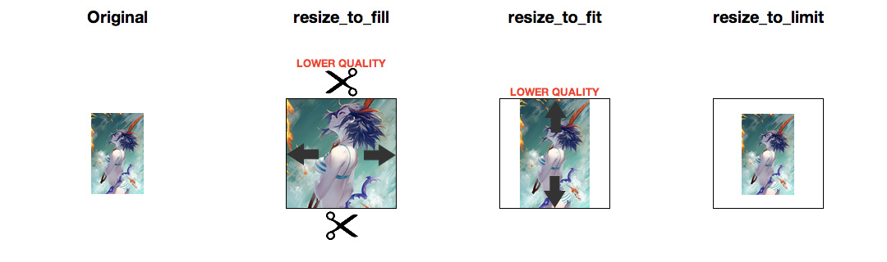

CarrierWave resize_to* methods cheatsheeet
==========================================

Before we start: do not forget `include CarrierWave::MiniMagick` line for this methods.

### Resize to fill

Using: `process :resize_to_fill => [200, 150]`

Selected rectangle will be fully filled by image. If system will need, image will be resized and croped.

One side using: `process :resize_to_fill => [200, 0]`

### Resize to fit

Using: `process :resize_to_fit => [400, 400]`

Image will be fit for selected rectangle: will be resized for touching closer side of rectangle, but not croped;

One side using: `process :resize_to_fit => [400, nil]`

### Resize to limit

Using: `process :resize_to_limit => [260, 340]`

Works like "resize_to_fit", but image can resize only to smaller size (save quality mode).

One side using: `process :resize_to_limit => [260, nil]`

### Examples

#### Bigger size landscape oriented image

#### Smaller size landscape oriented image

#### Bigger size square image

#### Smaller size square image

#### Bigger size portrait oriented image

#### Smaller size portrait oriented image

